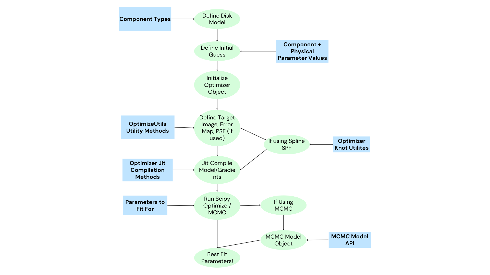
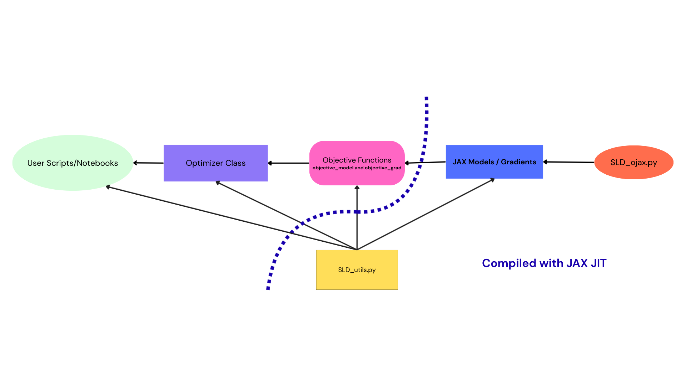

# GRaTeR-JAX: Architecture & Workflow Overview

This page provides a **high-level introduction**, **conceptual workflow**, and **block-diagram–driven understanding** of the GRaTeR-JAX codebase. It is intended to help new users and contributors quickly understand how the different components fit together—from user scripts and notebooks, through optimization logic, down to JAX-compiled disk models and gradients.

## Installation

To install GRaTeR-JAX and its dependencies, create a new Conda environment with Python and run:

```sh
pip install grater-jax
```

Make sure you have JAX installed with the correct backend for your hardware:

```sh
pip install --upgrade "jax[cpu]"  # or "jax[cuda]" for GPU
```

Highly recommended to install this on a fresh environment, just to be safe.

---

## 1. What is GRaTeR-JAX?

**GRaTeR-JAX** is a JAX-native, differentiable implementation of the classical GRaTeR scattered-light debris disk framework. It is designed to:

- Forward-model scattered-light images of circumstellar disks  
- Enable **gradient-based optimization** and **probabilistic inference (MCMC)**  
- Run efficiently on CPU/GPU via **JAX JIT compilation**

The library cleanly separates:

- **Physical disk models**
- **Objective functions (likelihoods + gradients)**
- **Optimization / inference orchestration**

---

## 2. End-to-End User Workflow

At a high level, a typical GRaTeR-JAX workflow looks like:

1. Define a **disk model** (density profile, scattering phase function, PSF handling)
2. Specify **initial parameter guesses** and configuration
3. Load a **target image**, error map, and optional empirical PSF
4. JIT-compile the forward model and gradients
5. Run either:
   - Deterministic optimization (SciPy), or
   - Bayesian inference (MCMC)
6. Inspect best-fit parameters and diagnostics

This flow is summarized visually in the block diagram below.

---

## 3. High-Level Optimization Flow Diagram

The diagram below represents the **conceptual optimization pipeline** exposed to the user.



### Key stages

- **Define Disk Model**
  - Disk type
  - Dust distribution
  - Scattering phase function
  - On-axis / off-axis PSF handling

- **Define Initial Guess**
  - Morphological parameters
  - Phase-function parameters
  - Throughput maps / misc parameters

- **Initialize Optimizer**
  - Creates a central object coordinating data, parameters, and JAX functions

- **Target Image & PSF Setup**
  - Image preprocessing
  - Error map construction
  - Optional empirical PSF injection

- **JIT Compilation**
  - Forward model
  - Gradients (analytic via JAX autodiff)

- **Optimization / MCMC**
  - SciPy minimization **or**
  - MCMC sampling and posterior analysis

---

## 4. Internal Code Architecture

GRaTeR-JAX is organized around a **clean separation of concerns**. The diagram below shows how the main modules interact.



### Core components

#### User Scripts / Notebooks
- Entry point for most users
- Define models, parameters, and run fits
- Examples:
  - `DiskTutorial.ipynb`
  - `FitsTutorial.ipynb`
  - `SpeedComparision.ipynb`

#### Optimizer Class
- Central orchestration layer
- Owns:
  - Parameter vectors
  - Bounds and transforms
  - Links to objective functions

#### Objective Functions
- `objective_model`
- `objective_grad`
- Wrap JAX disk models into scalar likelihoods

#### JAX Models / Gradients
- Pure, functional disk forward models
- Fully differentiable
- No side effects

#### `SLD_utils.py`
- Shared utilities:
  - Image preprocessing
  - PSF handling
  - Data normalization
- Used by both:
  - Objective functions
  - Optimizer logic

#### `SLD_ojax.py`
- Low-level JAX disk model definitions
- Performance-critical code

---

## 5. JAX JIT Compilation Strategy

One of the key design goals of GRaTeR-JAX is **performance without sacrificing clarity**.

- Disk models are written as **pure JAX functions**
- Objective functions wrap those models
- The optimizer **JIT-compiles once**, then reuses compiled kernels

This results in:

- Massive speedups over legacy NumPy implementations
- Stable gradients for both optimization and MCMC
- Identical code paths for CPU and GPU execution

---

## 6. Where to Go Next

- **Getting started**
  - `DiskTutorial.ipynb`
  - `FitsTutorial.ipynb`

- **Performance benchmarking**
  - `SpeedComparision.ipynb`

- **API reference**
  - See module-level documentation in the optimization and disk_model subpackages

This page is intentionally conceptual. Once this mental model is clear, the individual APIs and classes should feel significantly easier to navigate.

---
